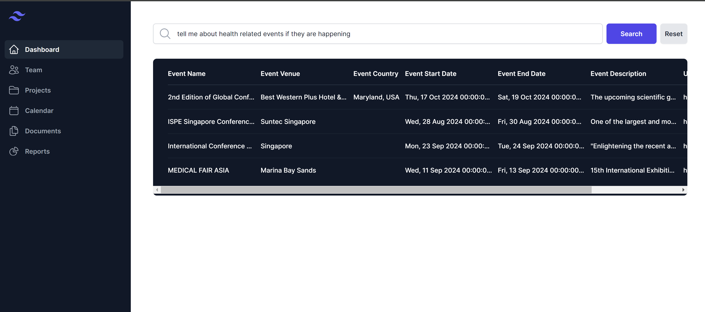
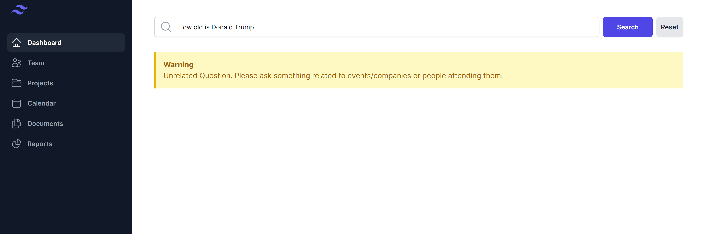

# React Front End

This front-end caters to the need for having a UI component for connecting to the backend ai application.

This is a [Next.js](https://nextjs.org/) project bootstrapped with [`create-next-app`](https://github.com/vercel/next.js/tree/canary/packages/create-next-app).

## Getting Started

First, run the development server:

```bash
npm run dev
# or
yarn dev
# or
pnpm dev
# or
bun dev
```
## Key Functionalities
1. Communicate with backend service
2. Users can use the input field for writing down their natural language (in order to search the database)
3. User can reset all the fields to restore the default state
4. App also has a prompt shown to the user if nothing is searched already.
5. Will show a warning to the user if unrelated question is asked by them.
6. Will throw an error to the user the backend sends an error while fetching relavent data
## Screenshots



## Key Challenges
The front end is quite straight forward. There is a next app, which uses Tailwind for styling. Moreover, I also have made my own custom components (like, Input, Button, Table) in order to help speed development and as it is a good practise to write reusable code.
## Suggested Improvements
I could have certainly taken more time to further poslih th UI. Adding a login/sign up feature would have be good for authorization. 

Also, I feel like I could have added some routes, where the inputs would have been more fine tuned for asking more niche questions (related just to people, companies etc)

More importanly, pagination could also have been added, but all these changes would also need changes to be done on the backend itself.